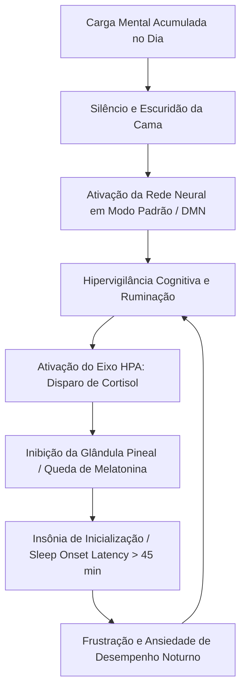

# 🧠 Neurobiologia do Sono e Sobrecarga Mental Feminina

---

## 1. O Fenômeno da Carga Mental Invisível (Mental Load)
A mente feminina moderna frequentemente opera sob o que a neuropsicologia chama de **"Multitarefa Vigilante Contínua"**:
- Gestão do trabalho profissional;
- Gestão invisível do lar, suprimentos, alimentação e logística familiar;
- Manutenção de redes de cuidado (pais idosos, filhos, parceiro(a), amigos);
- Autocobrança estética, profissional e de produtividade constante.

Durante o dia, os estímulos externos mascaram a exaustão com cortisol e adrenalina. Quando a mulher deita e as luzes se apagam (eliminação de ruído sensorial externo), o cérebro finalmente "abre espaço" para processar o volume reprimido, resultando no disparo súbito da **Default Mode Network (DMN)** — a rede neural responsável pela autorreflexão, ruminação e antecipação de ameaças.

---

## 2. A Cascata Neuroquímica da Insônia Noturna

---

## 3. O Papel do Tônus Vagal e do Sistema Parassimpático

Para que o cérebro transicione do estado de vigília (ondas Beta, 13-30 Hz) para a sonolência (ondas Alfa, 8-12 Hz) e sono profundo (ondas Teta e Delta, 0.5-4 Hz), é fisiologicamente mandatório **aumentar o tônus parassimpático através do Nervo Vago**.

### Mecanismos Acionados no "Desligue-se":
1. **Respiração 4-7-8 (Dr. Andrew Weil / Fisiologia Cardiorrespiratória):**
   - 4 segundos de inspiração nasal lenta.
   - 7 segundos de retenção de oxigênio (aumenta ligeiramente a pressão intratorácica e estimula barorreceptores carotídeos).
   - 8 segundos de expiração labial contínua (sinal direto para o nó sinoatrial diminuir a frequência cardíaca).
2. **Descompressão Somática Facial e Mandibular:**
   - A articulação temporomandibular (ATM) e os músculos masseteres são os primeiros a contrair sob estresse emocional. Relaxar conscientemente a mandíbula e a língua desliga o gatilho proprioceptivo de alerta no tronco encefálico.
