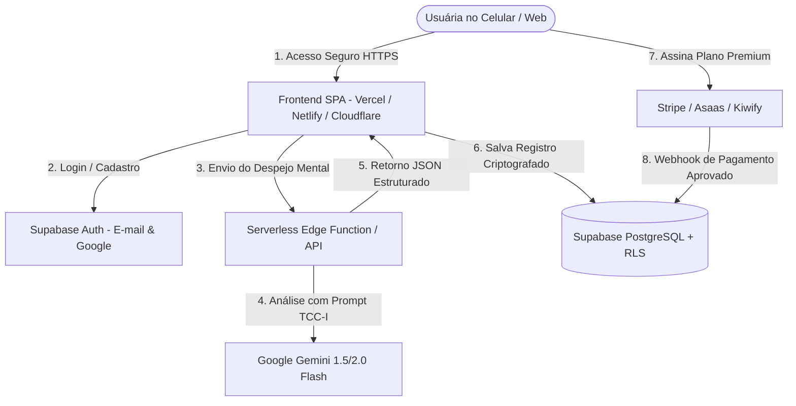

# 🚀 Guia de Produção: Backend, Banco de Dados, IA Real e Pagamentos (MicroSaaS)

Este guia detalha a arquitetura completa e o passo a passo para transformar o **Desligue-se** em um MicroSaaS funcional em produção, com banco de dados seguro, autenticação, IA real (Gemini) e cobrança recorrente (PIX e Cartão).

---

## 🏛️ 1. Arquitetura Técnica Recomendada



---

## 🗄️ 2. Banco de Dados & Autenticação (Supabase)

O **Supabase** oferece PostgreSQL com **Row Level Security (RLS)** nativo, essencial para garantir que os diários noturnos sejam 100% privados e inacessíveis por outros usuários.

### Script SQL para Criar no Supabase (SQL Editor):

```sql
-- 1. Habilitar UUIDs
CREATE EXTENSION IF NOT EXISTS "uuid-ossp";

-- 2. Tabela de Perfis de Usuárias
CREATE TABLE public.profiles (
  id UUID REFERENCES auth.users ON DELETE CASCADE PRIMARY KEY,
  email TEXT NOT NULL,
  nome TEXT,
  plano TEXT DEFAULT 'free' CHECK (plano IN ('free', 'premium_mensal', 'premium_anual')),
  stripe_customer_id TEXT,
  subscription_status TEXT DEFAULT 'inactive',
  created_at TIMESTAMP WITH TIME ZONE DEFAULT timezone('utc'::text, now()) NOT NULL
);

-- 3. Tabela de Registros do Diário Noturno
CREATE TABLE public.journal_entries (
  id UUID DEFAULT uuid_generate_v4() PRIMARY KEY,
  user_id UUID REFERENCES auth.users ON DELETE CASCADE NOT NULL,
  raw_text TEXT NOT NULL,
  triaged_data JSONB NOT NULL,
  routine_duration_minutes INT DEFAULT 3,
  sleep_mood TEXT CHECK (sleep_mood IN ('terrible', 'medium', 'great', NULL)),
  created_at TIMESTAMP WITH TIME ZONE DEFAULT timezone('utc'::text, now()) NOT NULL
);

-- 4. Habilitar Segurança por Linha (Row Level Security - RLS)
ALTER TABLE public.profiles ENABLE ROW LEVEL SECURITY;
ALTER TABLE public.journal_entries ENABLE ROW LEVEL SECURITY;

-- 5. Políticas de Segurança (Usuária só acessa os seus próprios dados)
CREATE POLICY "Usuária visualiza seu próprio perfil" 
ON public.profiles FOR SELECT USING (auth.uid() = id);

CREATE POLICY "Usuária atualiza seu próprio perfil" 
ON public.profiles FOR UPDATE USING (auth.uid() = id);

CREATE POLICY "Usuária gerencia seus próprios diários" 
ON public.journal_entries FOR ALL USING (auth.uid() = user_id);

-- 6. Trigger automático para criar perfil no cadastro
CREATE OR REPLACE FUNCTION public.handle_new_user()
RETURNS TRIGGER AS $$
BEGIN
  INSERT INTO public.profiles (id, email, nome)
  VALUES (new.id, new.email, new.raw_user_meta_data->>'full_name');
  RETURN NEW;
END;
$$ LANGUAGE plpgsql SECURITY DEFINER;

CREATE TRIGGER on_auth_user_created
  AFTER INSERT ON auth.users
  FOR EACH ROW EXECUTE PROCEDURE public.handle_new_user();
```

---

## 🤖 3. Conexão com IA Real (Gemini API via Serverless Function)

Nunca coloque a chave de API da IA diretamente no frontend. Crie uma função serverless (Vercel `/api/triage.js` ou Supabase Edge Function):

```javascript
// api/triage.js (Vercel Serverless Function em Node.js)
import { GoogleGenAI } from '@google/genai';

export default async function handler(req, res) {
  if (req.method !== 'POST') return res.status(405).json({ error: 'Método não permitido' });

  const { text } = req.body;
  if (!text) return res.status(400).json({ error: 'Texto não fornecido' });

  const ai = new GoogleGenAI({ apiKey: process.env.GEMINI_API_KEY });

  const systemInstruction = `
    Você é o motor cognitivo do aplicativo "Desligue-se", fundamentado em TCC-I (Terapia Cognitivo-Comportamental para Insônia), Efeito Zeigarnik e Terapia de Aceitação e Compromisso (ACT).
    Sua missão é receber a bagunça mental de uma mulher antes de dormir e classificar tudo em um JSON estruturado para permitir que o cérebro dela desligue e descanse em paz.

    Responda EXCLUSIVAMENTE em formato JSON com o seguinte schema:
    {
      "tomorrow": [
        { "action": "Ação atômica mastigada para amanhã", "original": "frase dita" }
      ],
      "wait": [
        { "item": "Pendência que pode esperar sem prazo", "note": "Guardado com segurança no cofre" }
      ],
      "release": [
        { "concern": "Preocupação incontrolável / incerteza futura", "reframe": "Reenquadramento compassivo e gentil de soltura" }
      ],
      "rumination": [
        { "loop": "Pensamento repetitivo / autocobrança", "validation": "Validação acolhedora de que ela já foi suficiente hoje" }
      ]
    }
  `;

  try {
    const response = await ai.models.generateContent({
      model: 'gemini-1.5-flash',
      contents: text,
      config: {
        systemInstruction,
        responseMimeType: 'application/json'
      }
    });

    const parsedData = JSON.parse(response.text);
    return res.status(200).json(parsedData);
  } catch (error) {
    console.error('Erro na chamada da IA:', error);
    return res.status(500).json({ error: 'Falha ao processar triagem' });
  }
}
```

---

## 💳 4. Recebendo Pagamentos (Stripe / Asaas / Kiwify)

### Opção A: Stripe Billing (Padrão Global para SaaS)
1. Crie uma conta no **Stripe** e crie 2 produtos com preços recorrentes:
   - **Plano Mensal:** R$ 19,90/mês
   - **Plano Anual:** R$ 147,00/ano
2. No clique do botão "Assinar", chame a API do Stripe para abrir o **Stripe Customer Portal / Checkout Session**.
3. Configure o **Webhook do Stripe** (`/api/stripe-webhook`) para ouvir o evento `checkout.session.completed` e `invoice.payment_succeeded`.
4. Ao receber o evento de pagamento com sucesso, a função atualiza a tabela `profiles`:
   ```sql
   UPDATE public.profiles 
   SET plano = 'premium_mensal', subscription_status = 'active' 
   WHERE stripe_customer_id = 'cus_123';
   ```

### Opção B: Kiwify ou Kirvano (Rápido e Muito Forte no Brasil com PIX)
- Crie o produto no Kiwify com opção de assinatura (R$ 19,90/mês no cartão e R$ 147/ano no PIX/Cartão).
- Crie um Webhook no Kiwify apontando para o seu backend. Quando o status for `approved`, ativa o plano do e-mail correspondente no Supabase.

---

## 🌐 5. Hospedagem Gratuita & Domínio Próprio

1. **Repositório GitHub:** Suba a pasta do projeto para um repositório no GitHub.
2. **Deploy na Vercel (Recomendado):**
   - Acesse [vercel.com](https://vercel.com) e conecte sua conta GitHub.
   - Clique em **"Add New Project"** e selecione o repositório.
   - Em **Environment Variables**, adicione:
     - `GEMINI_API_KEY`: Sua chave do Google AI Studio.
     - `SUPABASE_URL`: URL do seu projeto Supabase.
     - `SUPABASE_ANON_KEY`: Chave pública do Supabase.
     - `STRIPE_SECRET_KEY`: Chave secreta do Stripe.
   - Clique em **Deploy**. Seu site estará no ar em menos de 1 minuto com HTTPS e CDN mundial.
3. **Domínio Próprio (ex: `desligue.se` ou `desliguese.app`):**
   - Registre o domínio no Registro.br ou Cloudflare (~R$ 40/ano).
   - No painel da Vercel, vá em *Settings > Domains* e aponte os registros DNS (CNAME e A record).
